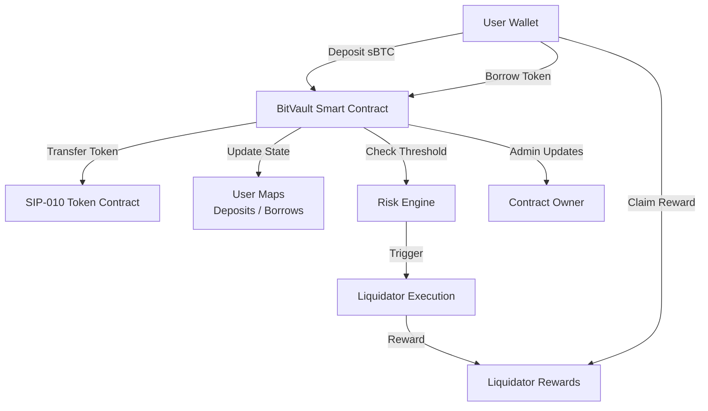

# BitVault Protocol

## Decentralized Bitcoin Lending Platform Built on Stacks

## Overview

**BitVault Protocol** is a decentralized, over-collateralized lending platform that enables Bitcoin holders to unlock liquidity without selling their BTC. Built on the **Stacks blockchain**, it leverages smart contracts and trustless mechanisms to ensure secure, transparent, and censorship-resistant lending, using **sBTC** as collateral.

## Key Features

* **Collateralized Bitcoin Lending**
  Deposit sBTC to borrow assets without selling your BTC.

* **Dynamic Risk Controls**
  Adjustable interest rates and liquidation thresholds managed by the protocol owner.

* **Trustless Liquidations**
  Automated liquidation of under-collateralized loans with incentivized liquidators.

* **Token-Agnostic Compliance**
  Designed to work with SIP-010 compliant fungible tokens.

* **Built on Stacks Layer 2**
  Inherits Bitcoin’s security while enabling smart contract programmability.

## 📐 Protocol Architecture

## Protocol Components

### State Variables

* `contract-owner`: Principal authorized to manage protocol parameters.
* `protocol-paused`: Boolean flag for emergency pause.
* `total-deposits` / `total-borrows`: Aggregate protocol metrics.
* `interest-rate`: Dynamic interest rate in basis points.
* `liquidation-threshold`: Ratio triggering liquidation (default 80%).

### Core Maps

* `user-deposits`: Tracks individual sBTC collateral.
* `user-borrows`: Stores user's borrowed amount and corresponding collateral.
* `liquidator-rewards`: Accumulates rewards for liquidators.

### Constants

* `MIN-COLLATERAL-RATIO`: 150% minimum for borrowing.
* `MAX-INTEREST-RATE`: Cap on APR to prevent abuse.
* `LIQUIDATION-THRESHOLDS`: Range limits for triggering liquidation.
* `MAX-REWARD-MULTIPLIER`: Limit on liquidation incentive rewards.

## Core Functionality

### 1. `initialize(token-contract)`

Initializes the protocol with the allowed SIP-010 token.

### 2. `deposit-collateral(token-contract, amount)`

Users deposit sBTC to enable borrowing. Validates token and updates state.

### 3. `borrow(token-contract, amount)`

Allows borrowing based on collateral value. Validates against risk thresholds.

### 4. `repay(token-contract, amount)`

Enables users to repay outstanding loans and restore borrowing capacity.

### 5. `liquidate(token-contract, user, amount)`

Allows any user to liquidate under-collateralized loans and earn rewards.

### 6. `claim-rewards(token-contract)`

Claim accumulated liquidation rewards.

## Administrative Controls

* `set-interest-rate(uint)`: Adjust protocol interest rate.
* `set-liquidation-threshold(uint)`: Update risk threshold.
* `pause-protocol()` / `unpause-protocol()`: Emergency controls for halting or resuming operations.

## Read-Only Functions

* `get-user-deposits(user)`
* `get-user-borrows(user)`
* `get-protocol-stats()`

## Security & Validation

* **Authorization:** Only the contract owner can update critical parameters.
* **Validation:** Inputs are rigorously checked (e.g., overflow-safe math, sufficient collateral).
* **Fail-safes:** Protocol can be paused to protect users and funds during irregular activity.

## SIP-010 Compatibility

The protocol strictly adheres to the **SIP-010** trait for fungible token interactions, ensuring compatibility with other DeFi primitives on the Stacks blockchain.

## Future Improvements

* Integration with oracles for dynamic BTC pricing.
* Governance mechanism to decentralize protocol control.
* Support for multiple collateral types (e.g., xBTC, aBTC).
